# BellaBox (Bella) 系统架构设计说明书

## 1. 架构总览与分层设计

BellaBox 遵循 **Clean Architecture（整洁架构）** 与 **现代 Android 模块化架构** 规范，严格实现关注点分离（Separation of Concerns），杜绝臃肿类（God Class）与巨型 Activity。

```mermaid
flowchart TD
    subgraph UI_Presentation["Presentation Layer (Jetpack Compose)"]
        HomeUI["feature-home (Dashboard & Controls)"]
        NodesUI["feature-nodes (Node Manager & Details)"]
        SubUI["feature-subscriptions (Subscription Manager)"]
        GroupsUI["feature-groups (Strategy Groups)"]
        RulesUI["feature-rules (Routing & Rule-Sets)"]
        DNSUI["feature-dns (DNS Settings & Diagnostics)"]
        SpeedUI["feature-speedtest (Speed Test & Quality)"]
        ToolsUI["feature-tools (Network Diagnostics)"]
        SettingsUI["feature-settings (Preferences)"]
        AboutUI["feature-about (Version Info & Diagnostics)"]
    end

    subgraph State_Layer["State & ViewModel Layer"]
        VMs["ViewModels (StateFlow / SharedFlow)"]
        MVI["MVI Intent & Single Source of Truth"]
    end

    subgraph Domain_Layer["Domain / Engine Layer"]
        StateMachine["ConnectionStateMachine (Global State Source)"]
        ConfigGen["SingboxConfigBuilder (Validation & Synthesis)"]
        Adapter["SingboxEngineAdapter (libbox bridge)"]
        NodeDeduplicator["NodeFingerprintEngine (Deduplication)"]
        StrategyEngine["StrategySelectionEngine (Consistent Hash, Failover)"]
        SpeedTestEngine["SpeedTestEngine (Multi-Stage Isolated Measurement)"]
    end

    subgraph Service_Layer["Android Service & Platform Layer"]
        VpnService["BellaVpnService (Android VpnService)"]
        TUN["PlatformInterfaceWrapper (sing-tun bridge)"]
        NetMonitor["DefaultNetworkMonitor (NetworkCallback & Auto-Recovery)"]
        NotificationMgr["ForegroundNotificationManager (Persistent Notification)"]
    end

    subgraph Core_Engine["Core Engine (Sing-box 1.15.0-alpha.9)"]
        libbox["libbox.aar (Go CGO / gomobile)"]
        singboxCore["Sing-box Testing Core (af60b5e)"]
    end

    subgraph Data_Layer["Data & Persistence Layer"]
        RoomDB["BellaDatabase (Room SQLite)"]
        DataStore["PreferencesDataStore"]
        Keystore["AndroidKeystoreSecurity (Encrypted Sensitive Data)"]
    end

    UI_Presentation --> State_Layer
    State_Layer --> Domain_Layer
    Domain_Layer --> Service_Layer
    Domain_Layer --> Data_Layer
    Service_Layer --> Core_Engine
```

---

## 2. 核心模块职能划分

### 2.1 UI 表现层 (`feature-*`)
- 完全使用 **Jetpack Compose** 结合 **Material 3** 构建。
- 每个特性模块完全解耦，通过 Navigation 路径或路由接口进行导航。
- 绝不直接访问数据库实体或底层 Sing-box API，所有数据与事件交互严格通过 ViewModel 驱动。

### 2.2 核心业务与引擎层 (`singbox-engine`)
- **ConnectionStateMachine**：整个应用唯一的全局单例连接状态源。定义 8 种清晰严谨的生命周期状态：`IDLE`, `STARTING`, `CONNECTING`, `CONNECTED`, `RECONNECTING`, `STOPPING`, `STOPPED`, `FAILED`。
- **SingboxConfigBuilder**：负责将用户选择的节点、策略组、分流规则、DNS 配置及 TUN 选项合成为合法的 Sing-box JSON 格式配置，并在注入内核前执行严谨的语义预检校验。
- **SingboxEngineAdapter**：封装对底层 `libbox` 的启动、重载（Reload）、关闭、查询状态及日志捕获接口，确保 Java/Kotlin 与 Go 层调用的边界清晰。

### 2.3 网络与服务层 (`vpn-service`, `core-network`)
- **BellaVpnService**：继承自 Android `android.net.VpnService`，负责申请 VPN 权限、建立虚拟网卡 TUN、通过 `protect()` 保护物理通信 Socket，以及管理前台服务保活通知。
- **PlatformInterfaceWrapper**：实现 Sing-box `PlatformInterface`，承接 TUN 文件描述符交换、系统 DNS 查询转发、连接归属（Connection Owner）分析及网络接口事件监听。
- **DefaultNetworkMonitor**：利用 Android `ConnectivityManager.NetworkCallback`，实时感知 Wi-Fi / 蜂窝数据 / 无网络切换，并调度状态机执行指数退避重连。

### 2.4 数据存储与安全层 (`core-database`, `core-common`)
- **Room Database**：管理节点（NodeEntity）、订阅源（SubscriptionEntity）、策略组（StrategyGroupEntity）、分流规则（RouteRuleEntity）与历史测速记录（SpeedTestRecordEntity）。
- **Android Keystore**：对订阅链接中携带的 Token、代理节点的 UUID、密码及敏感证书私钥进行硬件级对称加密。
