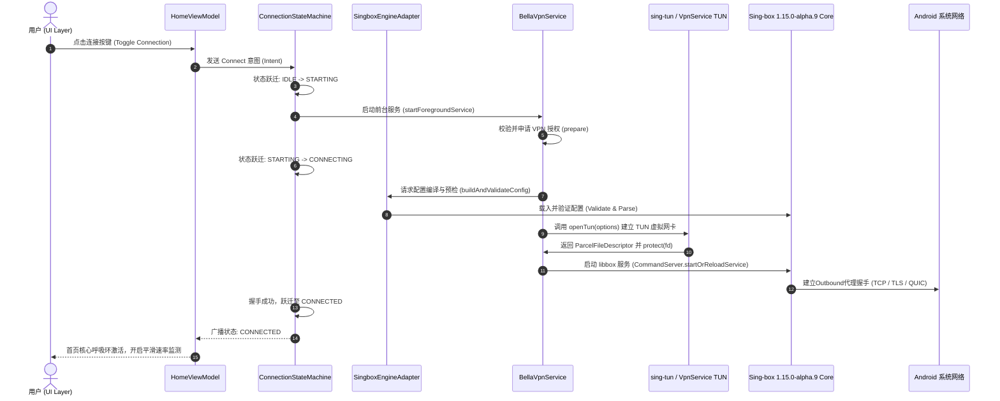

# BellaBox 网络架构与连接状态机设计规范

## 1. 全链路网络数据流

BellaBox 采用高内聚、低耦合的网络数据流动架构。从用户界面的交互操作到底层 Linux 网络内核的封包转发，层次边界严密划分：



---

## 2. 统一全局连接状态机 (Connection State Machine)

为彻底解决传统代理软件各子页面状态不同步、假断开、状态混乱的问题，BellaBox 实行**全应用唯一状态事实源（Single Source of Truth）**。

### 2.1 状态枚举定义 (`ConnectionState`)

```kotlin
enum class ConnectionState {
    IDLE,          // 未启动，待机状态
    STARTING,      // 正在唤醒后台服务与准备资源
    CONNECTING,    // 正在与代理节点执行握手、DNS 预热与 TUN 建立
    CONNECTED,     // 已连接，TUN 正在全量分流与代理流量
    RECONNECTING,  // 网络突变（Wi-Fi/移动网络切换）或节点异常，正在执行自动恢复
    STOPPING,      // 正在平稳清理 Socket 句柄、注销 TUN 与保存流量统计
    STOPPED,       // 已停止运行
    FAILED         // 异常终止（附带具体可解释的错误原因枚举）
}
```

### 2.2 状态转移矩阵

| 当前状态 | 触发事件 | 目标状态 | 伴随动作 |
| :--- | :--- | :--- | :--- |
| `IDLE` / `STOPPED` | `USER_CONNECT` | `STARTING` | 检查配置、请求 VPN 权限、启动前台通知 |
| `STARTING` | `SERVICE_READY` | `CONNECTING` | 创建 TUN 虚拟接口、向内核提交配置 |
| `STARTING` | `ERROR_PERMISSION_DENIED` | `FAILED` | 提示用户授予 VPN 权限，停止前台服务 |
| `CONNECTING` | `CORE_STARTED_SUCCESS` | `CONNECTED` | 开启流量监控协程、启动心跳检测 |
| `CONNECTING` | `HANDSHAKE_TIMEOUT` | `FAILED` | 抛出 `ConnectionTimeoutException`，附带目标 IP 与节点名称 |
| `CONNECTED` | `USER_DISCONNECT` | `STOPPING` | 关闭 TUN 文件描述符，停止前台保活 |
| `CONNECTED` | `NETWORK_LOST` / `IP_CHANGED`| `RECONNECTING` | 保持前台服务，触发指数退避自动重连 |
| `RECONNECTING` | `NETWORK_RESTORED` | `CONNECTING` | 重建链路，复用连接池 |
| `RECONNECTING` | `MAX_RETRY_EXCEEDED` | `FAILED` | 终止重连，提示网络不可达 |
| `STOPPING` | `CLEANUP_DONE` | `STOPPED` | 释放全部内存资源，重置为就绪态 |

---

## 3. 网络切换自愈机制 (NetworkCallback & Recovery)

Android 系统在蜂窝移动网络（Cellular）与无线局域网（Wi-Fi）之间切换时，底层路由表与默认网络接口发生变更。BellaBox 通过实现双重网络感知架构避免“假死”现象：

1. **系统级感知**：注册 `ConnectivityManager.NetworkCallback`，监听 `onAvailable`、`onLost`、`onCapabilitiesChanged` 及 `onLinkPropertiesChanged`。
2. **底层保护**：所有底层出口 Socket 均在创建时通过 `VpnService.protect(fd)` 绑定到物理底层网络，防止流量环路回入 TUN 接口。
3. **退避自愈算法**：遇到网络闪断时，系统进入 `RECONNECTING` 状态，采用指数退避机制重试：
   $$\Delta t = \min(t_{\text{base}} \times 2^{n}, t_{\text{max}})$$
   其中 $t_{\text{base}} = 500\text{ms}$，$t_{\text{max}} = 5000\text{ms}$，最大连续失败重试次数限制为 5 次，避免发热与电池耗尽。
