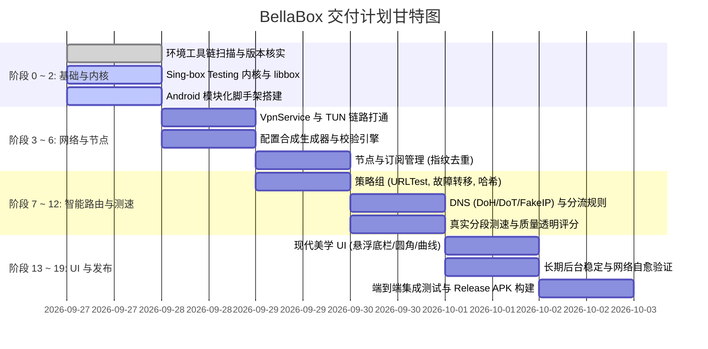

# BellaBox 开发阶段与交付计划 (PROJECT_PLAN.md)

## 1. 里程碑规划 (Milestones)

---

## 2. 阶段任务分解

### 阶段 0：工作区扫描与环境确认 (已完成)
- 验证 JDK 17, Android SDK API 35, NDK r25, Go 1.25+ 环境。
- 确认官方最新 Alpha 为 `v1.15.0-alpha.9`（基于官方 testing 分支，commit `af60b5e`）。

### 阶段 1：工程脚手架与设计系统初始化 (进行中)
- 设立干净的模块化架构（`core-*`, `singbox-engine`, `vpn-service`, `feature-*`）。
- 配置统一的 `Theme.kt`、`Color.kt`、`Shape.kt`（14dp~28dp）。

### 阶段 2：libbox.aar 编译与适配器封装 (进行中)
- 编译 Sing-box 官方 testing 分支源码生成 `libbox.aar`。
- 实现 `SingboxEngineAdapter`，封装底层启动、重载与状态采集。

### 阶段 3：VpnService 与最小可运行代理
- 编写 `BellaVpnService`，实现 TUN 网卡配置与文件描述符保护。
- 建立单节点直接代理连通性链路。

### 阶段 4：配置生成器与校验系统
- 编写 `SingboxConfigBuilder`，将数据模型映射为合法的 JSON 配置。
- 内置配置静态语法预检与纠错提示。

### 阶段 5：节点管理与订阅中心
- 支持单节点解析（VLESS, VMess, Trojan, SS, Hysteria 2, TUIC）。
- 支持 Base64 / Clash / Sing-box 订阅拉取与基于节点参数的特征去重。

### 阶段 6：智能策略组与故障转移
- 实现一致性哈希（Consistent Hashing）策略。
- 实现故障转移（Failover）与最低延迟选择策略。

### 阶段 7：DNS 与应用级分流
- 组合系统 DNS、国内直连 DNS 与国外代理 DNS。
- 支持应用黑白名单分流。

### 阶段 8：多阶段真实测速与质量评估
- 严禁假数据。测速细分 TCP Connect、TLS Handshake、HTTP Delay 与吞吐量。
- 呈现透明可解释的综合网络质量评分。

### 阶段 9：现代 UI 落地与平滑动效
- 悬浮底栏、核心连接呼吸盘、实时平滑速率曲线图。
- 统一浅色/深色主题无感切换。

### 阶段 10：全面自动化测试与 Release APK 构建
- 单元测试覆盖配置生成、URL 解析、策略调度与状态机跃迁。
- 编译最终 Debug 与 Release 签名的 APK 安装包。
