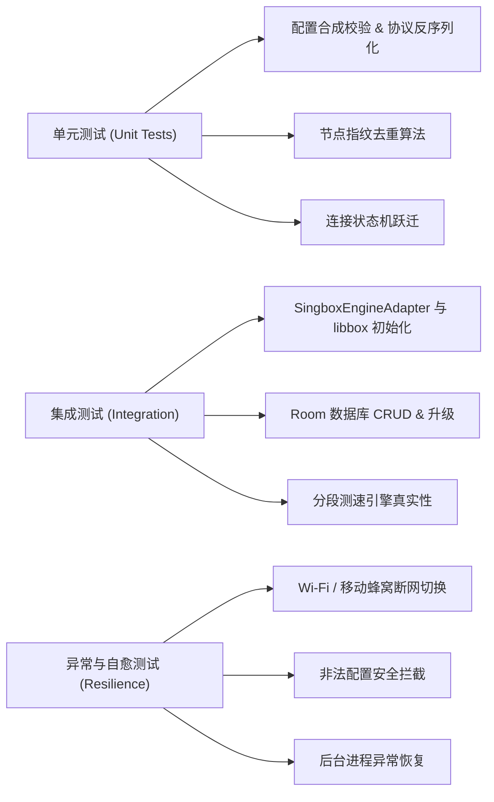

# BellaBox 自动化测试与质量保障体系 (TEST_PLAN.md)

## 1. 测试体系结构

BellaBox 建立涵盖 **单元测试 (Unit Tests)**、**集成测试 (Integration Tests)**、**网络异常恢复测试 (Chaos & Resilience Tests)** 与 **性能回归基准 (Benchmark)** 的完整质检管道。

---

## 2. 关键核心测试用例矩阵

| 测试编号 | 测试分类 | 核心验证点 | 预期达标结果 |
| :--- | :--- | :--- | :--- |
| **TC-01** | 配置构建器 | 针对包含 VLESS Reality、Hysteria2 的节点生成合法 Sing-box JSON | 生成配置通过内核语法校验，关键参数完整无丢失 |
| **TC-02** | 节点去重 | 导入两个同 IP、同端口、同 UUID 但备注名称不同的订阅节点 | 去重引擎基于指纹判定为同一节点，合并历史延迟数据 |
| **TC-03** | 状态机 | 触发从 `CONNECTED` 到网络中断再到网络恢复的连续事件 | 状态机严格从 `CONNECTED` $\to$ `RECONNECTING` $\to$ `CONNECTING` $\to$ `CONNECTED` |
| **TC-04** | 真实测速 | 隔离执行 TCP 连接握手与 HTTP 时延测试 | 捕获到真实的 socket 建连时间，各节点时延各异且有合理波动，无硬编码 |
| **TC-05** | 一致性哈希 | 多次针对相同域名请求计算出口节点映射 | 相同 Key 始终映射至确定节点；移除某节点时仅影响局部哈希槽 |
| **TC-06** | 异常配置防御 | 注入畸变或缺损的 JSON 字符串尝试加载 | 适配器优雅抛出 `InvalidConfigurationException`，App 绝不崩溃 |

---

## 3. 真实网络环境验证清单

在打包 Release 前，必须执行实机网络贯通测试：
1. 节点导入与解析（标准分享链接 / 订阅格式）。
2. TUN 网卡建立与数据包分流（国内域名直连、国外域名代理）。
3. 真实公网 IP 与地理位置查询返回代理服务器节点地址。
4. 长时间运行（30 分钟连续下载）内存无持续爬升。
